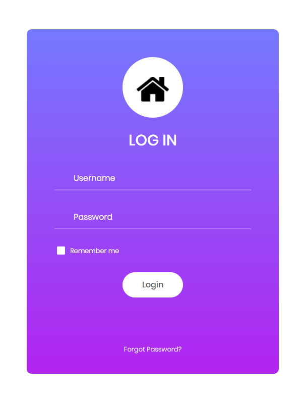
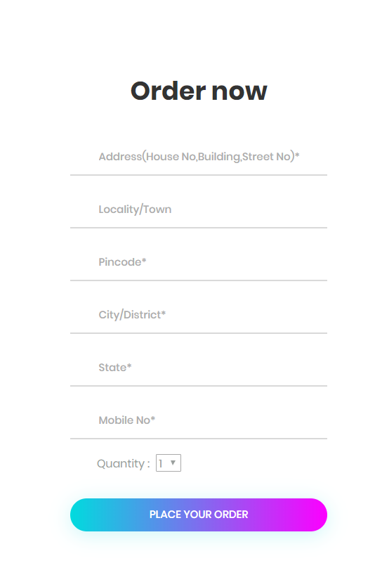

# The-dajngo-project
<h2>An E-commerce site using django framewok</h2>
                                                        
                                                      Documentation

  <h2><i> Functionality specs :</i></h2>
     <h4> > Have  functionality of registration and authentication of users</h4>
     <h4> > Have functionality of ordering clothes</h4>
     <h4> > Have functionality of showing user's orders and it's details</h4>
     <h4> > Have a functionality of contact page</h4>
     <h4> > Have functionality of checking whether the user is authenticated or not before ordering</h4>
   
 <h2><i>Home page :</i></h2>
    
  <h3 align="center">Section 1</h3>
   
  

  
  

    
  <h3 align="center">Section 2</h3>
  

  
  

    
  <h3 align="center">Section 3</h3>
  

  
  

    
  <h3 align="center">Section 4</h3>
   
  

  
  

     
  <h3 align="center">Authentication pages</h3>
   
   

   
    

      
   <h3 align="center">Order page</h3>
   
   

   
    

      
    <h3 align="center">My orderes pages</h3>
   
   

   
    

     
   <h3 align="center">Contact page</h3>
   
   

   
    

     

------------------------------------------------------------------------
<h3> Work in progress ---- </h3>

